# Projet NET4104 - Réception d'un signal BLE émis par ESP32 sur le channel 37

Projet s'inscrivant dans le cours NET4104 à Télécom SudParis. 
**Auteurs :**
- Valentin LANTIGNY ; 
- Jeremy LENOIR ;
- Romain MOREAU ;
- Alan VAN TRIGT.

**Encadrant :** 
- Rémy GRUNBLATT.

## Introduction

Dans le monde de la communication sans fil, la technologie Bluetooth Low Energy (BLE) a gagné en popularité en raison de sa faible consommation d'énergie et de sa large gamme d'applications. La possibilité de reproduire la chaîne de transmission BLE pour comprendre et manipuler les signaux émis est d'un intérêt particulier pour de nombreux domaines, de la domotique à l'Internet des Objets.

Dans cette étude, notre objectif est de comprendre comment récupérer et décoder un signal émis par un module ESP32 en utilisant le protocole BLE sur le canal de publicité (channel advertising) n°37. Cette tâche peut sembler complexe, mais en décomposant le processus en différentes étapes et en utilisant les outils appropriés, nous pouvons explorer les mécanismes sous-jacents de cette transmission sans fil.

Notre plan de recherche se décompose en trois grandes parties. Tout d'abord, nous explorerons des interfaces codes hardware. Par la suite, nous aborderons l'utilisation de GNU Radio, un logiciel de traitement du signal et de communication, pour des analyses plus approfondies et une manipulation avancée des signaux BLE. Enfin, nous utiliserons Python, avec ses bibliothèques spécialisées, pour décoder le signal reçu.

Cette approche progressive nous permettra de couvrir un large éventail d'outils et de techniques, de la programmation embarquée à la manipulation avancée de signaux, dans le but ultime de maîtriser la reproduction et la compréhension de la chaîne de transmission Bluetooth Low Energy.

# 1. Choix des technologies
Émission/Réception BLE avec ESP32
Lors de notre exploration pour créer une architecture client-serveur en Bluetooth Low Energy (BLE) avec l'ESP32, nous avons identifié trois solutions potentielles. Dans cette section, nous détaillons les avantages et les inconvénients de chacune de ces solutions.

Arduino IDE
Avantage : La liaison avec l'ESP32 est directement gérée au sein de l'IDE, offrant ainsi une facilité d'utilisation et la possibilité de se baser sur des exemples existants pour démarrer rapidement.

Désavantage : Cependant, les librairies disponibles peuvent ne pas être toujours tenues à jour, ce qui peut poser des problèmes de compatibilité avec les versions plus récentes de l'ESP32 ou avec d'autres composants.

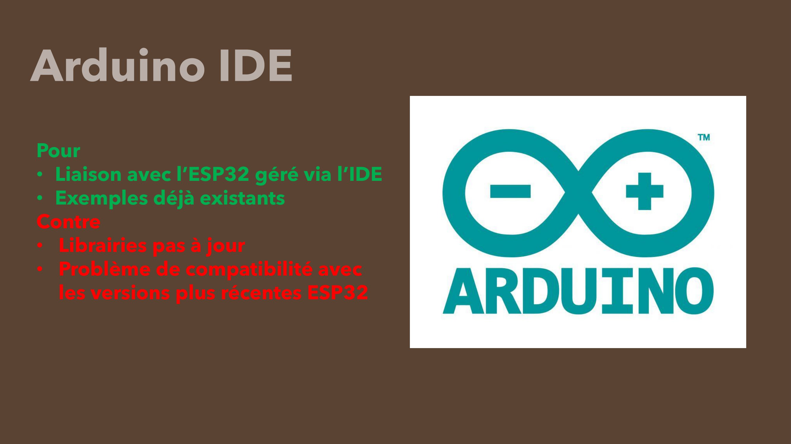

Micropython
Avantage : Micropython offre la possibilité de travailler avec Python, un langage largement utilisé et apprécié pour sa simplicité et sa lisibilité. Cela peut faciliter le développement et la maintenance du code pour certains utilisateurs.

Désavantage : Cependant, l'utilisation de Micropython demande un travail de préparation assez conséquent, notamment en ce qui concerne l'importation de la librairie Micropython sur l'ESP32, ce qui peut ajouter une étape supplémentaire dans le processus de développement.

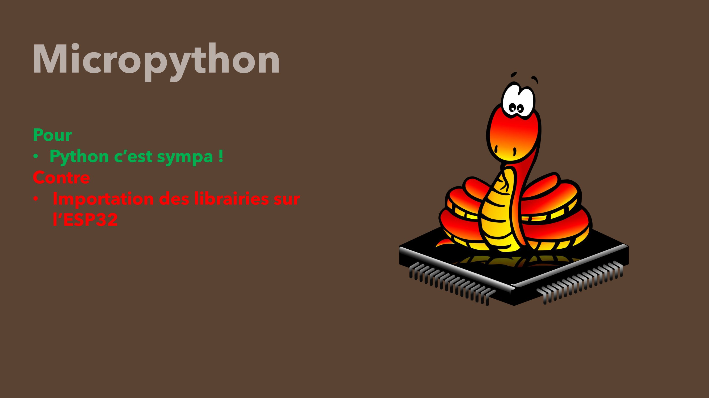

ESP-IDF
Avantage : L'ESP-IDF (Espressif IoT Development Framework) est la solution native pour le développement sur les microcontrôleurs ESP32, offrant ainsi une compatibilité et une intégration optimales avec les fonctionnalités matérielles de ces dispositifs. De plus, en tant que version officielle, elle est souvent la plus à jour.

Désavantage : Cependant, la programmation en C, utilisée dans l'ESP-IDF, peut être considérée comme plus complexe pour certains développeurs habitués à des langages de haut niveau comme Arduino ou Python.

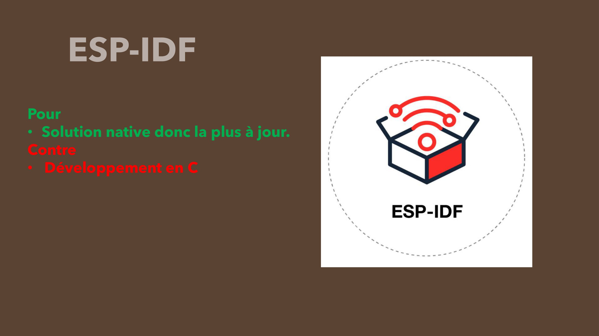

###   2. Communication entre deux ESP32S3

Lors de notre phase d’exploration, nous avons essayé de faire communiquer deux ESP32S3 entre eux. Pour cela, nous avons testé différents IDE et langages en commençant par Arduino qui, après de nombreuses tentatives ne donnait pas de résultats satisfaisants. Nous avons donc ensuite utilisé le langage Micropython qui offrait une plus grande liberté de manœuvre. Seulement, il était bien plus complexe de mettre en place l’environnement Micropython et de trouver des modèles pour comprendre comment faire communiquer les ESP32S3.

**Définitions**

MicroPython est une implémentation légère du langage de programmation Python 3 qui est optimisée pour fonctionner sur des microcontrôleurs et d’autres petits systèmes. Voici quelques détails clés sur MicroPython :

•	Implémentation Python : MicroPython est une implémentation complète du langage de programmation Python 3 qui fonctionne directement sur du matériel embarqué comme l'ESP32S3. Il comprend un sous-ensemble de la bibliothèque standard Python.

•	Environnements Contraints : MicroPython est conçu pour fonctionner sur des microcontrôleurs et dans des environnements contraints. Il est assez compact pour tenir et fonctionner dans seulement 256k d’espace de code et 16k de RAM.

•	Interactivité : MicroPython offre une invite interactive (le REPL) pour exécuter des commandes immédiatement. Cela permet aux développeurs de tester rapidement des morceaux de code et de voir les résultats en temps réel.

•	Open Source : MicroPython est écrit en C99 et tout le noyau de MicroPython est disponible pour une utilisation générale sous la licence MIT.

L’ESP32-S3 est un système sur puce puissant, conçu pour être utilisé dans des appareils connectés à Internet. Il peut se connecter à Internet via Wi-Fi et communiquer avec d’autres appareils via Bluetooth Low Energy. Il est également capable de traiter des tâches complexes comme l’intelligence artificielle. 

**Installation**

Pour pouvoir coder en Micropython sur l’ESP32S3, il faut réaliser un certains nombres d’étapes.
Tout d’abord, il faut que l’ordinateur puisse communiquer avec l’ESP32S3 via le port UART. Il faut donc accéder au « gestionnaire de périphériques » puis « Ports (COM et LPT) » sur Windows. A partir de là, vous pouvez accéder aux paramètres du port sur lequel votre ESP32S3 est branché en cliquant dessus. 
Vous pouvez ensuite mettre à jour le pilote de périphérique dans l’onglet « Pilote ». 
Si cela ne marche pas, vous pouvez trouver le driver sur ce site : https://www.silabs.com/developers/usb-to-uart-bridge-vcp-drivers?tab=overview et installer le pilote manuellement en choisissant « Parcourir mon poste de travail pour rechercher des pilotes » puis en cliquant sur le fichier téléchargé.
Une fois le pilote installé, il faut ensuite créer l’environnement Micropython dans les ESP32S3. Pour ce faire, il faut télécharger le firmware de le site de Micropython : https://micropython.org/download/ESP32_GENERIC_S3/  (télécharger le .bin) puis, depuis un invité de commande, entrer les commandes suivantes : 

Installer esptool : ```pip install esptool```

Supprimer tout environnement potentiellement présent : 
```esptool.py --chip esp32s3 --port {nom du Port} erase_flash```

Intégrer le firmware Micropython dans l’ESP32S3
```esptool.py --chip esp32s3 --port {nom du Port} write_flash -z 0 {emplacement du fichier téléchargé auparavant}```

Parfait ! L’ESP32S3 est maintenant prêt à recevoir et exécuter du code en Micropython.
Nous utiliserons par la suite le logiciel Visual Studio Code pour programmer nos ESP32S3.

Une fois sur l’interface VS Code, nous allons télécharger les extensions Micropython, Python et Python Debugger pour une manipulation plus aisée du code. (Les fichiers Micropython sont des fichiers « .py », on peut donc ouvrir des fichiers Micropython comme des fichiers Python.)
Très important : Pour pouvoir interagir avec notre ESP32S3 avec un environnement Micropython, il faut installer l’outil adafruit-ampy :
Entrer dans le terminal de VS Code la commande suivante : ```pip install adafruit-ampy```
Maintenant, pour envoyer du code dans l’ESP32S3, nous utiliserons la commande suivante :
```ampy –port {nom du port} run {nom du fichier Micropython}```
Ensuite, depuis le terminal de VS Code, nous allons devoir télécharger une librairie dans le répertoire de projet : « aioble » qui sera très utile pour gérer la communication BLE dans notre code. 
Entrer la commande suivante pour installer « aioble » : ```mpremote mip install aioble```

Voilà ! Vous êtes prêt à exécuter votre code Micropython sur votre ESP32S3 !

**Communication BLE entre deux ESP32S3**

Après avoir réalisé toutes les étapes d’installation, nous avons donc écrit et implémenté le code dans deux ESP32S3.
Le premier ESP32S3 sert de serveur. C’est lui qui envoie les données en continu et notifie si une connexion est établie.
Le second sert de client. Il scanne les appareils BLE aux alentours pour en trouver un en particulier : le serveur.
Voici les deux codes réalisés pour le client et le serveur : 

Description des fonctions de chaque code.
server.py :
1.	```import uasyncio as asyncio``` : Importe le module uasyncio et le renomme en asyncio. Ce module est similaire à la librairie « time ».
2.	```import aioble``` : Importe le module aioble qui est une bibliothèque pour la programmation Bluetooth Low Energy (BLE) asynchrone.
3.	```import bluetooth``` : Importe le module bluetooth pour utiliser les fonctionnalités Bluetooth.
4.	```import random``` : Importe le module random qui contient des fonctions pour générer des nombres aléatoires.
5.	```import struct``` : Importe le module struct qui fournit des fonctions pour convertir entre chaînes de bytes et types de données natifs Python (comme les nombres et les chaînes).
6.	```SERVICE_UUID = bluetooth.UUID(0x181A)``` : Définit l’UUID du service Bluetooth que le serveur va fournir. 0x181A est l’UUID du service.
7.	```CHARACTERISTIC_UUID = bluetooth.UUID(0x2A6E)``` : Définit l’UUID de la caractéristique Bluetooth que le serveur va fournir. 0x2A6E est l’UUID de la caractéristique de message.
8.	```_ADV_APPEARANCE_GENERIC = const(768)``` : Définit l’apparence de l’advertising Bluetooth. 768 est la valeur pour une apparence générique.
9.	```_ADV_INTERVAL_MS = 250_000``` : Définit l’intervalle de temps (en millisecondes) entre deux advertising.
10.	```service = aioble.Service(SERVICE_UUID)``` : Crée un nouveau service Bluetooth avec l’UUID spécifié.
11.	```characteristic = aioble.Characteristic(service, CHARACTERISTIC_UUID, read=True, notify=True)``` : Crée une nouvelle caractéristique Bluetooth avec l’UUID spécifié, qui peut être lue et qui envoie des notifications lorsque sa valeur change.
12.	```def _encode_decimal(c): return struct.pack("<h", int(c * 100))``` : Définit une fonction pour encoder un nombre en une chaîne de bytes et cela inclut les nombres décimaux avec un maximum de 99.99 (choix arbitraire).
13.	```async def sending_task()``` : Définit une tâche qui génère et écrit la valeur de t qui est envoyé vers l’autre ESP32S3.
14.	```async def peripheral_task()``` : Définit une tâche asynchrone qui attend des connexions Bluetooth et arrête l’advertising lorsqu’une connexion est établie.


client.py :

Nous importons les mêmes librairies que le serveur dans le code du serveur.

1.	```SERVICE_UUID = bluetooth.UUID(0x181A)``` : Définit l’UUID du service de l’appareil BLE que le client va rechercher. 0x181A est l’UUID du service de messagerie environnementale.
2.	```CHARACTERISTIC_UUID = bluetooth.UUID(0x2A6E)``` : Définit l’UUID de la caractéristique de l’appareil BLE que le client va rechercher. 0x2A6E est l’UUID de la caractéristique de message.
3.	```async def find_device()``` : Définit une fonction asynchrone qui recherche l’autre ESP32S3 en fonction de son nom et de son SERVICE_UUID.
4.	```def _decode_decimal(data): return struct.unpack("<h", data)[0] / 100``` : Définit une fonction pour décoder une chaîne de bytes en un nombre (décimal inclue : max 99.99).
5.	```async def main()```: : Définit la fonction principale qui recherche un appareil Bluetooth, se connecte à lui, découvre le service et la caractéristique spécifiés, puis lit la valeur de la caractéristique en boucle.

En lançant ces deux codes en même temps, on obtient :

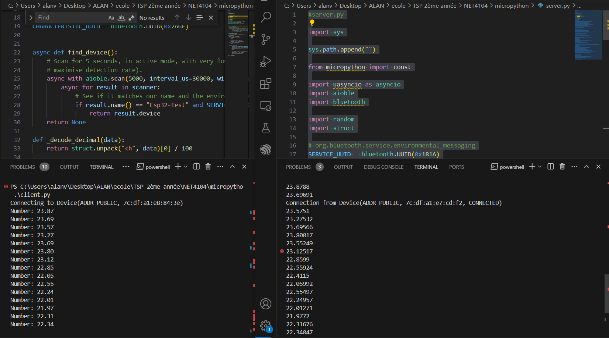

Les valeurs sont bien transmises d’un ESP32S3 à l’autre. Nous avons donc pu nous aider de ces fichiers Micropython pour réaliser la partie finale de notre projet.

Source : https://github.com/micropython/micropython-lib/tree/master/micropython/bluetooth/aioble/examples


###   2. GNU Radio 


Pour recevoir un signal Bluetooth Low Energy, la première étape va être de recevoir et démoduler les données. Pour ce faire, une antenne connectée à un HackRF comportant un oscillateur intégré (40 MHz) va permettre la bonne réception du signal et l'outil GNU Radio permettra d'effectuer la démodulation pour obtenir les données transmises.

Pour les caractéristiques techniques, la documentation `Bluetooth Core Specification v5.3`[^1] est utilisé comme référence. Dans le cadre du projet, seul le `canal 37 Advertising` sera étudié pour simplifier les démarches, celui-ci étant à la fréquence $f = 2.402 \ GHz$.
Le BLE utilisé également 40 canaux de 2 MHz de large, il faudra donc une fréquence d'échantillonnage $f_{e} = 4 MHz$ pour satisfaire le théorème de Nyquist-Shannon.  

Le HackRF [^2] est un émetteur - récepteur de la marque Great Scott Gadgets opérant de 1 MHz à 6 GHz. Comme plusieurs systèmes d'échantillonnage en quadrature, il peut présenter un _DC Offset_ : c'est un pic au centre du spectre causé par un biais interne. Pour faire face à ce problème, le choix retenu est de régler le HackRF sur une fréquence $f + \delta f$ puis d'effectuer un décalage fréquentiel de $-\delta f$ pour revenir au cadre d'étude [^3], ici, il sera fixé à $\delta f = 1.5 \ MHz$. Par ailleurs, les données sont au format I/Q (type *complex - float32*).

Le logiciel GNU Radio permet de traiter le signal, notamment pour moduler et démoduler. Deux types de données seront utilisés : les *complex Float 32* en sortie du HackRF, et des *bytes* après démodulation. 

**Réception et filtrage**

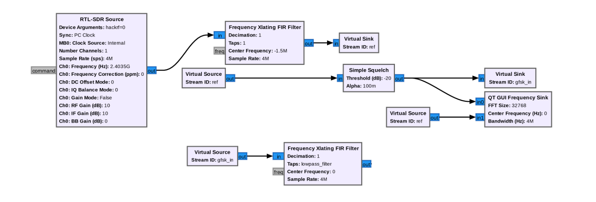

 Sous GNU Radio, le bloc `RTL-SDR Source` va permettre de recevoir le signal BLE. Il est réglé avec une fréquence $f = 2.0435 \ GHz$, et une fréquence d'échantillonnage $f_e = 4 \ MHz$.
Le décalage fréquentiel pour recentrer le signal est opéré par le bloc `Frequency Xlating FIR Filter`, et un `Simple Squelch` permet de traiter les données uniquement quand la puissance moyenne est supérieure à -80 dBm, ceci pour éviter d'avoir trop d'informations.

Enfin, un deuxième `Frequency Xlating FIR Filter` va servir cette fois de filtre passe-bande pour garder l'information sur 2 MHz. 

**Démodulation**

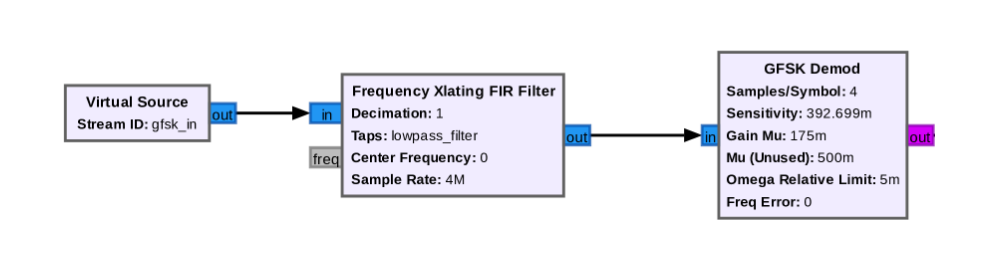

Le Core v5.3 décrit les paramètres principaux de la modulation GFSK.
Supposant un signal message $m$ à transmettre, sur une fréquence $f_m$ et d'amplitude $A_m$,  ainsi que le signal modulé $s_{FM}$ à une fréquence $f_c$ et une amplitude $A_c$. 
Il vient alors :

$$\begin{align*}
\begin{dcases}
{m(t) = A_m cos(2 \pi f_m t)} \\
{s_{FM}(t) = A_c cos[2\pi f_c t + \beta_f sin(2 \pi f_mt)]} \\
{\beta_f = \frac{k_f A_m}{2 \pi f_m}}
\end{dcases}
\end{align*}$$

$k_f$ est la sensibilité de la modulation, définis par $k_ f = \frac{2 \pi \Delta f_{max}}{A_m}$.

À noter que si $\beta_f$ << 1, la modulation est appelée Narrow Band Frequency Modulation (NBFM), et pour ($\beta_f$ > 1) elle est appelée Wideband Frequency Modulation (WBFM).

Pour démoduler le signal, il va falloir une boucle à verrouillage de phase, mais elle ne sera pas étudiée ici. Il existe en effet un bloc `GFSK Demod`, lui-même composé de trois autres blocs : un `Quadrature Demod`, un `Symbol Sync` et un `Binary Slicer`. Les deux premiers permettent de démoduler en quadrature (car la modulation fréquentielle est une modulation de phase) et de synchroniser l'horloge. Le dernier bloc lui permet d'obtenir uniquement des bits (0 ou 1).

Ici, pour plus de simplicité, ce sera le bloc `GFSK Demod` qui sera utilisé. Il y a seulement deux variables à changer :  le `Samples/Symbol`, défini comme le rapport de la fréquence d'échantillonnage sur le débit symbole :

$$\begin{align*}
sps = \frac{f_e}{D_s},
\end{align*}$$

et la `Sensitivity`, représentant l'écart possible de fréquence lors de la modulation :

$$\begin{align*}
s = \frac{\pi}{2} \frac{1}{sps}.
\end{align*}$$

La synchronisation d'horloge n'est pas étudiée ici, les valeurs sont celles par défaut. Cela correspond à l'algorithme de Mueller & Muller.

**Exportation**

Pour le BLE, l'envoi de donnée commence toujours par le bit de poids faible. C'est le rôle des deux derniers blocs, `Unpacked to Packed` et `File Sink` permettant d'obtenir une suite de byte dans un fichier suivant la convention _Petit Boutiste_.

Pour visualiser la réception (et donc voir quand une trame Bluetooth est reçu), un bloc `QT GUI Frequency Sink` permettra de voir le spectre du signal en temps réel ainsi que le signal retenu (_i.e._ quand sa valeur moyenne est à plus de -80 dBm), et un bloc `QT GUI Time Sink` permet de voir les bits.

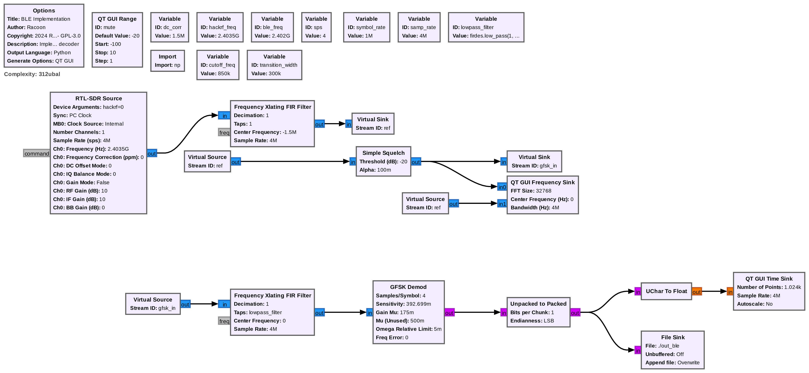

[^1]: Ressources Bluetooth: https://www.bluetooth.com/specifications/specs/core-specification-5-3/
[^2]: HackRF: https://greatscottgadgets.com/hackrf/one/
[^3]: DC offset : https://hackrf.readthedocs.io/en/latest/faq.html#bigspike.


###   3. Python

Maintenant que le signal Bluetooth Low Energy est démodulé, il faut désormais le décoder.
Pour rappel, un ESP 32 émet en continu sur le canal 37 Advertising, et le graphe GNU Radio a permis de démoduler le signal, en écrivant les bytes dans un fichier.

Le code `main.py` est composé de fonctions utiles pour le décodage et de la classe `BLEDecode` qui reprend la documentation `Bluetooth Core Specification v5.3` étape par étape. L'étude est restreinte aux trames avec les conditions suivantes :

- La trame est dans le canal 37 Advertising ;
- La transmission suit la variante LE 1M PHY (données non codées, débit 1 Mb/s).

Une trame est définie ainsi :

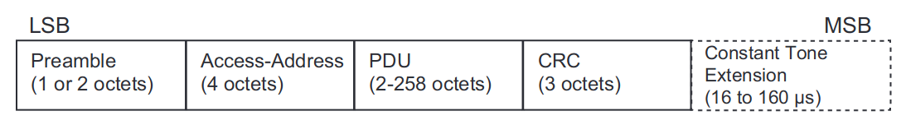

**Preamble**
La trame doit commencer par un octet valant `0b10101010`, soit `\xAA`[^4]. Le code python va donc parcourir l'ensemble du fichier et mettre dans une liste `position_index` l'index de chaque occurence de `\xAA`.

Chaque préambule peut être le début d'une trame. Donc chaque index présent dans la liste `position_index` est potentiellement le début d'une trame.
Le code python va parcourir l'ensemble des index et va vérifier que le contenu est en adéquation avec la documentation. Le curseur `pos` est initié avec la valeur inscrite dans `position_index` et va être incrémenté par la taille mentionné dans la Trame LE 1M PHY.

**Access Address**
Après le préambule vient 4 octets correspondant à l'**Access Address**. Dans le cas du canal d'Advertising, il vaut systèmatiquement `0x8E89BED6`[^5]. La fonction `swap_bytes` permet d'inverser les bytes, car le premier réceptionné est celui de poids faible.
Si l'Access Address est différent, la trame est abandonné et la variable `pos` prend la valeur suivante dans la liste `position_index`.

**PDU**
Cette partie peut avoir une taille de 2 à 258 octets. Le PDU est composé de deux éléments: un **Header** et un **Payload**, le premier étant d'une taille de 16 bits (soit 2 octets) et le second d'une taille allant de 1 à 255 octets.

Le Header est décomposé ainsi :

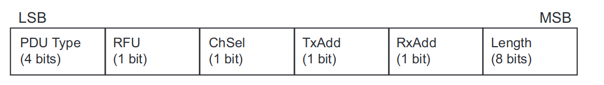

Toutefois, pour éviter la répétition de 0 ou de 1 (0b00000000 ou 0b11111111), et donc pour éviter les erreurs, deux algorithmes sont utilisés:

- Le CRC (vérifier l'intégralité du message) ;
- Le Whitening (éviter les 0 ou les 1).

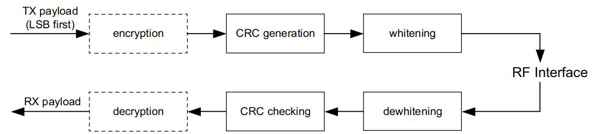

Comme l'étude porte sur la réception, il faut d'abord appliquer le "_dewhitening_".

**(De)Whitening**
L'algorithme utilise un registre à décalage à rétroaction linéaire (LFSR).

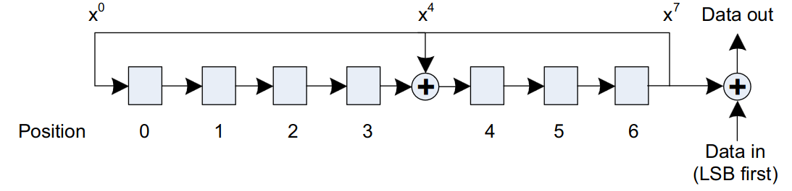

Le registre est initié ainsi[^6]:
- La Position 0 prend la valeur 1 ;
- Les Positions 1 à 6 prennent les valeurs du canal en commencant par le bit de poids fort (les 40 valeurs sont codés sur seulement 6 bits).
Ainsi, pour le canal 37,
$37 |_{10} = 100101|_2$, $Registre = 110010|_2$.

Le premier bit des données entrante (par exemple, pour 'f' dont la valeur binaire vaut 0b1100110, le premier bit est 0) est xorée avec le bit de la Position 6. La valeur est ensuite enregistré, et le registre est décalé d'un cran vers la droite (la valeur en Position 0 passe en Position 1, etc.). Subtilité : la Position 4 prend la valeur résultante du XOR entre le bit de la Position 3 et le bit de la Position 6.

A noter : si une valeur est xorée avec 0, sa valeur ne change pas (0 ^ 0 = 0, 0 ^ 1 = 1).
Au niveau du code Python, cela se traduit ainsi :
- Si le bit à la Position 6 vaut 1, le registre est xorée avec la valeur 0b10001000. Le registre est alors de taille 8, avec le bit de poids fort égal à 1, mais l'opération de décalage va enlever le premier bit et le registre retrouvera une taille valant 7.
- Si le bit à la Position 6 vaut 0, il n'y a pas d'opératoin à faire. La donnée reste échangé, car elle est xorée avec 0, le bit en Position 4 va prendre simplement la valeur du bit en Position 3 et le bit de poids fort sera 0.

**PDU Header**
Une fois l'algorithme appliqué sur les données correspondant au PDU Header, plusieurs valeurs sont mises à dispositions :
- PDU Types ;
- RFU ;
- ChSel ;
- TxAdd ;
- RxAdd ;
- Payload Length.

Les différents types sont présentés dans la documentation Bluetooth.
| PDU Type | PDU Name |
| --- | --- |
| 0b0000 | ADV_IND |
| 0b0001 | ADV_DIRECT_IND |
| 0b0010 | ADV_NONCONN_IND |
| 0b0011 | SCAN_REQ |
| 0b0100 | SCAN_RSP |
| 0b0101 | CONNECT_IND |
| 0b0110 | ADV_SCAN_IND |
| 0b0111 | ADV_EXT_IND |
| 0b1000 | AUX_CONNECT_RSP |

La dernière étape est le CRC, permettant de vérifier l'absence d'erreur. Comme la longueur est désormais connu, la fonction _Whitening_ peut être appliqué au PDU Header, PDU Payload et au CRC. Ce dernier représente 3 octets, soit 24 bits.

**CRC**
La fonction utilise également un algorithme LFSR.
Le registre est cette fois-ci de 24 bit. Une fois que l'ensemble des données (PDU Header et PDU Payload) sont passés bit par bit, le registre aura été décalé X fois, et les 24 bits du registre formeront les 3 octets à comparer avec ceux présent dans la trame.

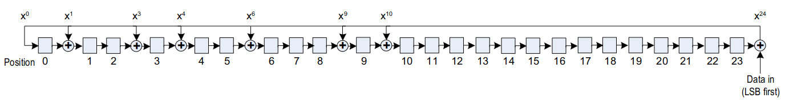

Comme la fonction _Whitening_, le décalage se fait par la droite, et certaines Positions sont xorées avec le bit en Position 24. Le registre est initialisé avec la valeur 0x555555[^7].

Pour le code Python, si le bit de poids faible (Position 24) à la même valeur que le bit entrant (celui de la donnée), le bit résultant du XOR vaudra 0. Le décalage sera simple. Si le bit vaut 1, il faut xoré le registre avec le bit 0b110110100110000000000000 (correspondant aux différentes Position où un XOR est nécessaire).

Pour terminer la fonction, les trois bytes sont extraits.

**Application**
Avec le précédent fichier issu de GNU Radio, le code donne ceci:

```BASH
Access Address found: b'8e89bed6'
PDU Type: ADV_IND
CRC correct.
{'Access Address': b'8e89bed6', 'Type': 'ADV_IND', 'RFU': 0, 'ChSel': 1, 'TxAdd': 0, 'RxAdd': 0, 'Length': 37, 'Payload': b'\xc9\xc8\xe7\xa1\xdf|\x02\x01\x06\x06\tESP32\x02\n\t\x11\x07K\x911\xc3\xc9\xc5\xcc\x8f\x9eE\xb5\x1f\x01\xc2\xafO', 'CRC': b'eL\x0b', 'Address': '0x7cdfa1e7c8c9'}
```

[^4]: Bluetooth Core Specification v5.3, Vol. 6, Part B, 2.1.1
[^5]: Bluetooth Core Specification v5.3, Vol. 6, Part B, 2.1.2
 [^6]: Bluetooth Core Specification v5.3, Vol. 6, Part B, 3.2
[^7]: Bluetooth Core Specification v5.3, Vol. 6, Part B, 3.1 

# Conclusion
